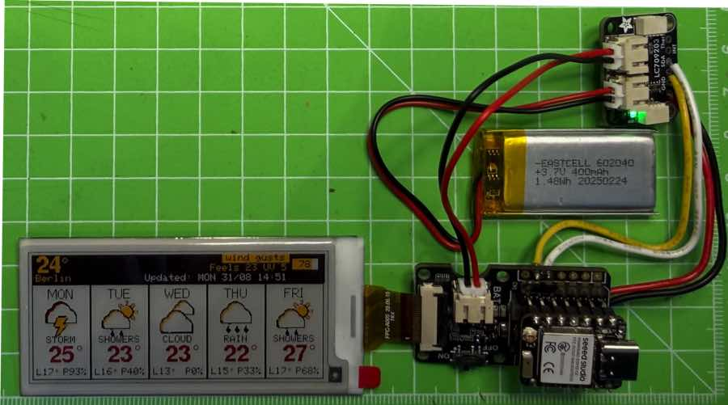
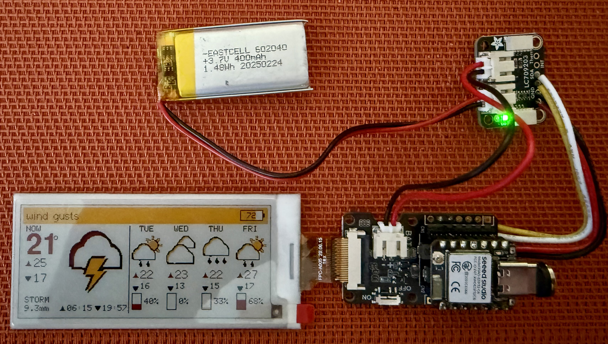
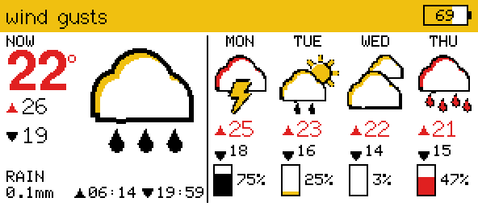
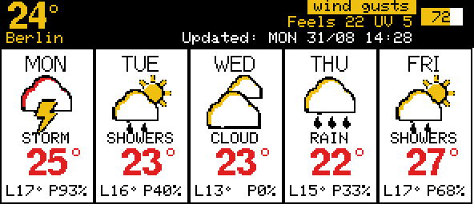
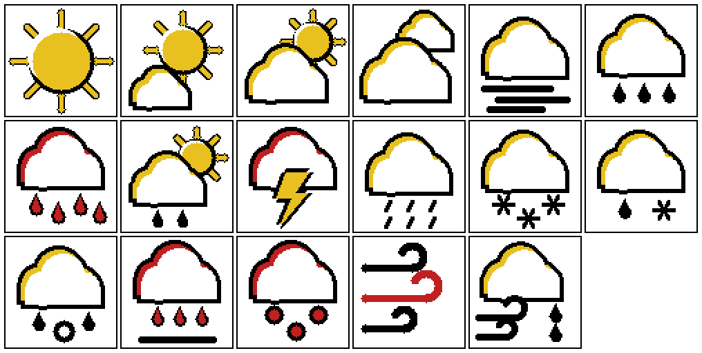
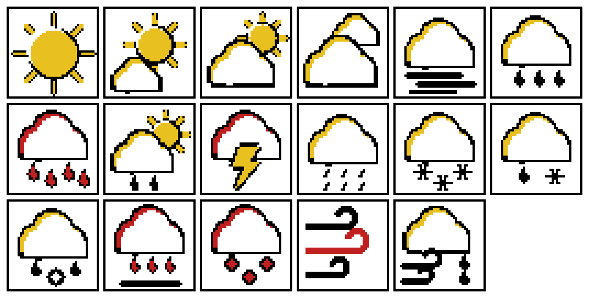

# JFG PaperCast

Build a crisp, low‑power 4‑color (black/white/yellow/red) weather dashboard on the **[Seeed Studio XIAO ESP32‑C6](https://wiki.seeedstudio.com/xiao_esp32c6_getting_started/)** with the **2.9" 128×296 BWRY e‑paper panel** and the **[Seeed XIAO ePaper driver board](https://wiki.seeedstudio.com/xiao_eink_expansion_board_v2/)**.  
This project focuses on a reliable, repeatable workflow: correct controller selection, correct pin mapping, and a proven render path.



## Why This Is Worth Building

- **Always‑on, almost‑no‑power**: e‑paper only consumes power while refreshing.
- **Legible at a glance**: high‑contrast layout, bold temperature, weather icons.
- **Self‑contained onboarding**: Wi‑Fi captive portal for iPhone/iPad/Mac.
- **Maker‑friendly**: PlatformIO project, no manual SDK installs.

---

## Hardware

- **MCU**: Seeed Studio XIAO ESP32‑C6  
- **Driver Board**: Seeed Studio XIAO ePaper driver board / expansion board V2  
- **Panel**: 2.9" BWRY e‑paper, 128×296  

### Optional: Adafruit LC709203F fuel gauge

A [LiPoly / LiIon fuel gauge breakout](https://www.adafruit.com/product/4712) (I²C, address `0x0B`)
that reports the pack's true voltage and state of charge. **Entirely optional** — without one the
firmware models the charge from how long it has spent awake and asleep, and marks every such reading
with a trailing `?` so a guess never masquerades as a measurement.

| | With the gauge | Without it |
|---|---|---|
| Percentage | Measured from the cell | Modelled from run time |
| Voltage | Reported | Not available |
| Shown as | `78%` | `78%?` |
| Survives a reboot | Yes — the gauge keeps counting | Resets its baseline |



Four wires to the XIAO, no soldering if you use a STEMMA QT cable. See
[`docs/wire-diagram.md`](docs/wire-diagram.md) for the step‑by‑step. Note in the photo
that the cell plugs into the **gauge**, and a second lead carries it on to the driver
board's `BAT` connector — the gauge has to sit in line with the pack to measure it.

| Gauge | XIAO ESP32‑C6 |
|---|---|
| `VIN` | `3V3` |
| `GND` | `GND` |
| `SDA` | `D4` (GPIO22) |
| `SCL` | `D5` (GPIO23) |

The battery connects to the **gauge**, and the gauge passes it through to the driver board — it has
to sit in line with the pack to measure it. Set your real pack size on the web page (**Settings →
Battery size**); the relevant firmware settings are `kBatteryGaugeEnabled`, `kBatteryProfile` and
`kBatteryThermistorB` in [`include/weather_config.h`](include/weather_config.h).

> **Set `kBatteryProfile` to match your cell.** `0` is an ordinary 3.7 V / 4.2 V LiPo — including
> every cell Adafruit sells — and `1` is a 3.8 V / 4.35 V high‑voltage cell. The Adafruit library's
> own `begin()` writes `1` under a comment claiming it is the 4.2 V profile, so a standard cell left
> on the library default is measured against a curve for a pack that charges 150 mV higher: it never
> reaches 100 % and reads low across the whole range. This firmware sets the profile explicitly.

**If the readings look wrong**, open `http://<device-ip>/batteryProbe`. It scans the I²C bus and
dumps the gauge's registers, which separates a wiring fault (nothing answers) from a configuration
fault (it answers, but with implausible numbers).

## Software Stack

- PlatformIO
- Arduino framework
- Seeed_GFX (vendored in `lib/Seeed_GFX`)

---

## Quick Start

### 1) Install PlatformIO

Install PlatformIO Core or use the PlatformIO IDE extension.

### 2) Build & Flash

```bash
platformio run -t upload -e seeed_xiao_esp32c6
```

`esptool` cannot sync with this board, so the first flash goes over the chip's built‑in JTAG:

```bash
PLATFORMIO_UPLOAD_PROTOCOL=esp-builtin pio run -e seeed_xiao_esp32c6 -t upload
```

After that, update over the air from the web UI — see [UserManual.md](UserManual.md#6-firmware-updates).

### 3) First Boot Setup

On first boot, the device starts a captive portal:

- Connect to **JFG-PaperCast-Setup**
- Your phone should open the setup page automatically
- Select Wi‑Fi, enter password, and save

The device reboots and fetches the forecast.

---

## PlatformIO Configuration

From `platformio.ini`:

```ini
[env:seeed_xiao_esp32c6]
platform = https://github.com/pioarduino/platform-espressif32/releases/download/stable/platform-espressif32.zip
board = seeed_xiao_esp32c6
framework = arduino
monitor_speed = 115200

build_flags =
    -DARDUINO_SEEED_XIAO_ESP32C6
    -DBOARD_SCREEN_COMBO=512
    -DUSE_XIAO_EPAPER_DRIVER_BOARD
```

The key here is **`BOARD_SCREEN_COMBO=512`** which selects the correct **JD79667** controller path for this panel.

---

## Wiring and Pin Mapping

This project uses the **Seeed XIAO ePaper driver board** pin map:

- `RST = D0`
- `CS = D1`
- `BUSY = D2`
- `DC = D3`
- `SCK = D8`
- `MOSI = D10`

The Seeed_GFX combo `512` + `USE_XIAO_EPAPER_DRIVER_BOARD` matches this exactly.

---

## On‑Device UI Features

- 5‑day forecast layout
- Bold max temperature
- Compact legend (L = low, P = precipitation **probability**)
- Weather icons in a single hand-authored four-colour set, at 80×80 and 40×40
- **Four selectable header layouts**: large current temperature, city name, both, or neither
- **Two configurable information lines** — feels‑like + UV, rain in mm, sunrise/sunset, or wind +
  gusts. The first line yields to a weather warning, or to the IP address after a cold boot
- **Weather warnings** — derived from the forecast, or official DWD warnings via Bright Sky
- Battery indicator with the charge percentage inside it, and a red strip when it runs low
- Auto refresh on a configurable interval (default 60 minutes), deep sleeping in between

### Display designs

Two complete designs ship in the firmware. Pick one from **Display** on the web page; the preview
updates as you choose, so you can compare them before saving. Both are real screenshots taken from
the device over `/preview.bmp`.

**Modern** — today as a hero panel, the rest of the week compact beside it:



The hero answers "what is it doing right now" without reading anything: an 80×80 icon, the current
temperature, and the day's high and low. The status strip carries the location, the update time and
the battery — and turns yellow with black text when a warning is active. Each day column pairs a
precipitation **bar** with the **probability** beside it, so the two elements carry two different
facts rather than restating one.

**Classic** — five equal day cards under a configurable banner:



Every day gets the same treatment, which is the better choice if you read the whole week rather than
mostly glancing at today. The banner above it is configurable in the ways described below.

| | Modern | Classic |
|---|---|---|
| Today | Hero panel, 80×80 icon | One card among five |
| Remaining days | 4 compact columns | 4 equal cards |
| Precipitation | Bar = amount, figure = probability | Text, `P70%` |
| Banner layouts / presets | Not used — the hero shows more than a preset could | Fully configurable |
| Best for | Glancing at today | Reading the week |

> The **layout** and **information line** selectors below shape the *classic* banner only. They are
> hidden when the modern design is selected, because the hero already shows more than any preset.

### Display layouts

The banner is built from three independent choices: what sits on the **left**, and what each of the
two **information lines** shows. Any layout combines with any pair of presets.

**Layout — the left of the banner:**

| Layout | Left element |
|---|---|
| `Temperature` | The current temperature, large (18 pt) with a degree ring |
| `Location` | The city name |
| `Temperature + location` | The temperature (12 pt) with the city name beneath it |
| `Info only` | Nothing — the full width goes to the information lines |

Temperature layouts fall back to the city name until the first reading arrives.

**Presets — what each information line renders:**

| Preset | Example | Shows |
|---|---|---|
| Feels‑like + UV | `Gefuehlt 19 UV 5` | Apparent temperature and UV index |
| Rain in mm | `Regen 2.4mm 60%` | Rainfall **amount** plus probability |
| Sunrise / sunset | `Sonne 06:12-20:02` | |
| Wind + gusts | `Wind 12 Boe 24` | Wind is shown nowhere else |
| Off *(second line only)* | | Leaves the line blank |

**Worked examples** — the same weather, three different configurations:

| Layout | Line 1 | Line 2 | Banner |
|---|---|---|---|
| Temperature | Feels‑like + UV | Sunrise/sunset | `26°` · `Gefuehlt 24 UV 5` / `Sonne 06:12-20:02` / `Updated: SAT 29/08 16:48` |
| Location | Rain in mm | Off | `Berlin` · `Regen 0mm 35%` / *(blank)* / `Updated: …` |
| Info only | Wind + gusts | Rain in mm | *(no left)* · `Wind 12 Boe 24` / `Regen 0mm 35%` / `Updated: …` |

The third line is always the update time. **Line 1 is not always your preset** — it yields to a
weather warning when one is active, and to the IP address after a cold boot or an address change.

---

## Web UI Features

Open the control page at `http://<device-ip>/`:

- **Panel preview** — a live picture of the e‑paper's own framebuffer, so you can see the display
  without looking at it
- **Firmware update over the air** — upload a `.bin` from the browser; no cable
- Wi‑Fi setup, rescan, manual SSID, static IP
- **Location, time zone and units** (°C/°F, km/h / mph)
- **Refresh interval** (15–240 min), **quiet hours**, low‑battery threshold
- **Timed keep‑awake** (15/30/60 min) for debugging, expiring on its own
- Language selector (EN/DE/ES/FR)
- Battery level (meter, percentage, voltage, and USB/charging state)
- Deep sleep on/off toggle
- Logs and status

**Full walkthrough: [UserManual.md](UserManual.md).**

---

## Battery and Power

The display refreshes on a **configurable interval (default 60 minutes)** and deep sleeps in
between. Each cycle is:

1. Wake (timer) → connect Wi‑Fi → fetch forecast → render the panel (~26 s total; the BWRY panel
   refresh alone takes ~19 s)
2. Stay awake for **30 seconds** so the web UI is reachable
3. Panel to DSLP, radio off, deep sleep until the next interval mark

### Expected runtime

On the 400 mAh pack, assuming ~90 mA awake and ~0.2 mA asleep:

| Awake window | Interval | Per day | Runtime |
|---|---|---|---|
| 120 s | 30 min | ~184 mAh | ~2 days |
| 30 s | 30 min | ~72 mAh | ~5.5 days |
| **30 s** | **60 min (default)** | **~35 mAh** | **~11 days** |

The least certain figure is the deep‑sleep current — it is dominated by the driver board's boost
converter, not the MCU. If runtime falls well short of the table, measure it with a multimeter in
series with the pack and correct `kEstimatedSleepUa` in
[include/weather_config.h](include/weather_config.h).

Details:

- The interval is set from the web UI (15/30/60/120/240 min) and persisted in NVS.
- Any HTTP request pushes the awake window forward, so an open browser tab (it polls `/status`
  every 8 s) keeps the device awake for as long as you need it — bounded by a **10‑minute hard cap**
  per wake cycle, so a forgotten tab or a router probing port 80 can never drain the pack.
- A failed forecast fetch retries after **5 minutes** instead of the full cycle.
- AP / captive‑portal setup mode **never** sleeps.
- The **Deep sleep between updates** toggle in the status card disables sleeping entirely
  (persisted in NVS) when you want the device permanently reachable.
- The sleep duration subtracts the time the wake cycle already used, so the render‑to‑render
  period stays at 30 minutes instead of drifting by the boot time.
- A cold boot (power‑on or reset) holds the device awake for a full **5 minutes**, so the web UI
  is always reachable after you power it on without racing the sleep timer.

---

### Time

Timestamps come from NTP, with the zone chosen in the web UI. The device carries **two strings per
zone** — the IANA name for the weather API, and a POSIX `TZ` string for the C library — because
there is no timezone database on the chip. Handing `configTzTime()` an IANA name like
`Europe/Berlin` silently yields UTC, which is exactly the bug this arrangement fixed.

### Battery level: measured, or estimated with a "?"

With no fuel gauge fitted, the firmware still knows exactly how long it spent awake and asleep, so
it integrates that against assumed currents to model the remaining charge. Modelled values are
always shown **with a trailing `?`** — `79?` on the panel, `79% ~estimated` on the web page — so an
estimate is never mistaken for a measurement.

Because the model cannot detect charging, it needs an explicit zero point: press
**"Battery charged"** in the web UI after every charge to reset it to 100 %. The relevant constants
(`kBatteryCapacityMah`, `kEstimatedActiveMa`, `kEstimatedSleepUa`) live in
[include/weather_config.h](include/weather_config.h).

**Battery size** is chosen in the web UI rather than compiled in, so this firmware suits whatever
cell you fit. It sets both the gauge's discharge profile (snapped to the nearest of the six the
LC709203F supports) and the capacity the modelled estimate divides by.

Fit an **Adafruit LC709203F** on the free D4/D5 pins and it takes over automatically, with real
voltage and state‑of‑charge and no `?`. Wiring and bring‑up:
**[docs/wire-diagram.md](docs/wire-diagram.md)**.

### Panel resilience

The vendored driver's `CHECK_BUSY()` originally spun forever waiting on the panel's BUSY line, so a
panel that stopped answering hung `epaper.begin()` before Wi‑Fi started — a blank screen *and* an
unreachable device. That wait is now bounded (30 s in operation, 5 s during init; a real BWRY
refresh takes ~19 s, so the guard must stay well clear of it). If the panel will not answer, the
firmware logs why, sets `panelReady: false` in `/status`, skips rendering and carries on booting, so
the web UI is still there to diagnose with. `GET /panelProbe` re‑tests the panel on demand and
reports the BUSY line's electrical state — `busyFloating=0, busyPullup=1` means nothing is driving
the line at all, which points at the FPC connector rather than firmware.

There is no alternative on this hardware: the driver board never routes `BAT_4V2` to the XIAO
(schematic rev 1.0 — it reaches only the power switch, the ETA9740 charger and the JST BAT
connector), and on the ESP32‑C6 the only ADC‑capable pins (D0/A0, D1/A1, D2/A2) are already used by
the panel for RST, CS and BUSY, while D4–D7 have no ADC at all.

The gauge is fitted and reporting real values. Without one, the firmware falls back to a **modelled**
estimate integrated from awake/asleep time, always shown with a trailing **`?`** so a guess is never
mistaken for a measurement; that mode needs the web UI's **Battery charged** button as its zero point
after each charge.

Configuration lives in [include/weather_config.h](include/weather_config.h) (`kBatteryGaugeEnabled`,
`kBatteryPackMah`, `kBatteryThermistorB`, `kBatteryLowPercent`, and the I²C pins). The gauge is left
in operating mode across deep sleep (~15 µA) so its state‑of‑charge tracking keeps running while the
MCU is asleep; `initRSOC()` is only re‑seeded on a cold boot.

## Language Selection

The **same language setting** controls both the **web UI** and the **e‑paper display** (labels, weekdays, and status text).

How to change it:

1. Open the web UI at `http://<device-ip>/`
2. Use the **Language** dropdown in the header
3. The page reloads and the e‑paper display updates immediately

Available languages: **English, German, Spanish, French**.

---

## Static IP Setup

In the web UI, enable **Static IP** and enter:

- IP address
- Gateway
- Subnet
- DNS 1 / DNS 2

The configuration is stored in NVS and applied on each connection.

---

## Weather Icons (4bpp)

Seventeen conditions, drawn for this panel's four colours. The set exists at two sizes — 80×80 for
the modern hero, 40×40 for the day columns of both designs:





**The two sizes are the same drawing code run at two scales, not one resampled into the other.** A
2:1 downsample on a palette with no intermediate tones has to decide each output pixel by a block
vote, which either eats the one-pixel outlines or doubles their weight — there is no anti-aliasing
to absorb the difference. Redrawing at 40 keeps a true single-pixel outline.

**The style**, and why it is what it is with four inks:

- **White body, black outline, and a lit rim** — a second copy of the shape offset up and left, with
  the white body drawn over it, leaving a crescent. With no intermediate tones that crescent is the
  only way to suggest a light source at all.
- **Rain is black; red means take notice.** Red is reserved for heavy precipitation, storms, hail and
  freezing rain, so it keeps the same meaning it has in the warning strip and the low-battery
  marker. Rendering every drizzle in red would spend that signal on nothing.
- **Yellow is sunlight**, on the sun itself and on the lit rim of a cloud with sun behind it.

### Regenerating them

The icons are generated, not hand-edited. Edit [`tools/gen_icons80.py`](tools/gen_icons80.py) and run:

```bash
python3 tools/gen_icons80.py     # no dependencies, pure standard library
```

It rewrites both headers and both preview images. Icons are authored in an 80-unit design space and
the primitives convert to pixels, which is what lets one definition serve both sizes.

The generator **reports any icon that draws outside its tile** rather than letting it be silently
truncated. This matters more than it sounds: a cloud's true extent is larger than its nominal size,
because the outline grows outward and the lit rim sits further up-left again, so art that looks
safely inside the tile in source coordinates can still lose its crown. Both sizes must report
`no clipping` before the output is worth flashing.

### Format

4‑bit indexed sprites, two pixels per byte, high nibble first, rendered with:

```cpp
epaper.fillRect(x, y, 40, 40, TFT_WHITE);
epaper.pushImage(x, y, 40, 40,
                 const_cast<uint16_t*>(reinterpret_cast<const uint16_t*>(kWeatherIcon40Clear)),
                 4);
```

Palette indices used by this project:

- `white = 0x00`
- `black = 0x0F`
- `yellow = 0x0B`
- `red = 0x06`

If red/yellow look swapped, fix the **indices** in the sprite header.

---

## Degree Symbol Fix

Some free fonts don’t include the `°` glyph. This project draws it manually:

```cpp
void drawDegreeSymbol(int16_t x, int16_t y, uint8_t radius, uint16_t color) {
  epaper.drawCircle(x, y, radius, color);
}
```

---

## Project Structure

```
.
├── src/                     # main app
├── include/                 # generated icon headers, config
├── lib/Seeed_GFX/           # graphics + driver stack
├── tools/gen_icons80.py     # draws the icon set; rewrites both headers
├── docs/                    # detailed guides
├── docs/images/             # screenshots and icon sheets used by this README
├── assets/                  # source images for icons
├── platformio.ini
└── partitions_singleapp.csv
```

---

## Deep‑Dive Docs

- `docs/EPAPER_2IN9_BWRY_XIAO_GUIDE.md`
- `docs/WEATHER_FORECAST_APP.md`
- `UserManual.md` — using the device: setup, settings, OTA updates, troubleshooting
- `docs/wire-diagram.md` — LC709203F fuel gauge wiring, step by step

---

## Common Pitfalls (Already Solved Here)

- Wrong controller family (JD79661 vs JD79667)
- Incorrect XIAO pin mapping
- Expecting drawing calls without `epaper.update()`
- Using partial refresh without validation

---

## Credits

- **Forecasts: [Open-Meteo.com](https://open-meteo.com/)**, used under
  [CC BY 4.0](https://creativecommons.org/licenses/by/4.0/). Open-Meteo asks for a credit with a link
  next to anywhere their data is displayed, which is why the web UI carries one in its footer.
- **Weather warnings (optional source): Deutscher Wetterdienst**, retrieved through
  [Bright Sky](https://brightsky.dev/). DWD's terms of use govern that data.
- **Graphics: [Seeed_GFX](https://github.com/Seeed-Studio/Seeed_Arduino_LCD)**, a TFT_eSPI fork,
  vendored in `lib/Seeed_GFX`.

## License

This project is licensed under the **Apache License 2.0**. See `LICENSE`.
